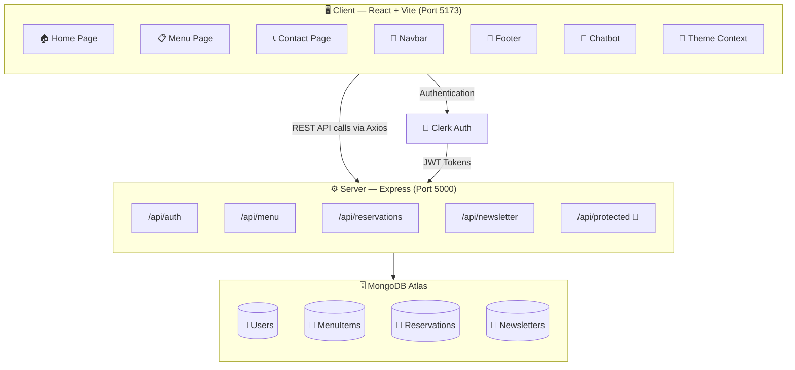
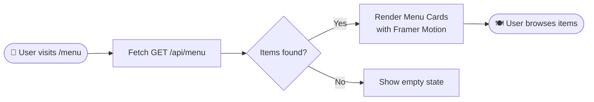
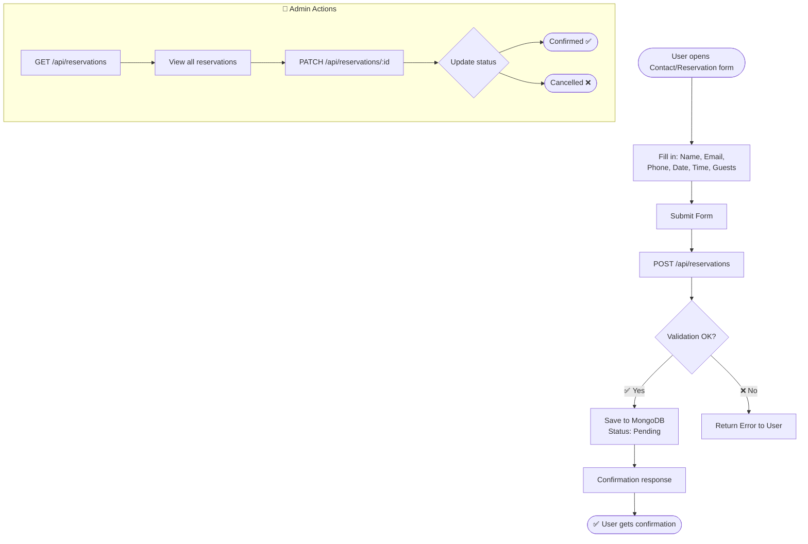
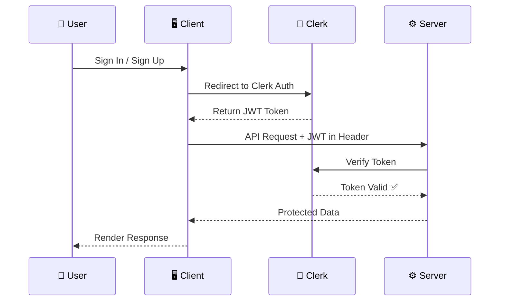
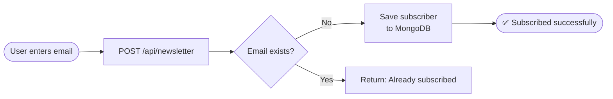
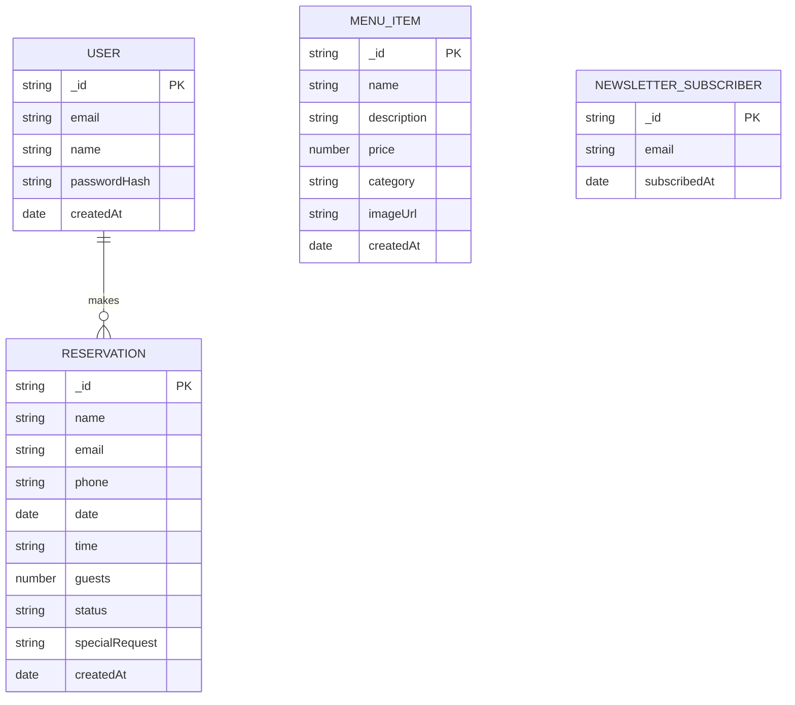
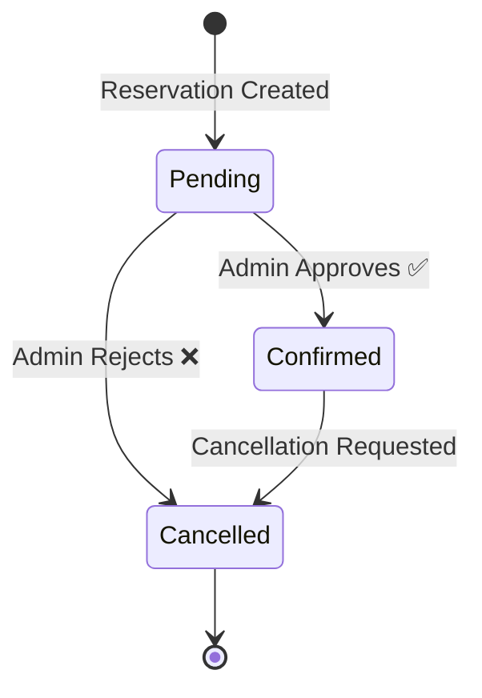

# 🍽️ Alviro — Modern Restaurant Web Application

<div align="center">


**A full-stack restaurant experience — seamless menus, table reservations, and more.**

[](https://react.dev/)
[](https://vitejs.dev/)
[](https://tailwindcss.com/)
[](https://expressjs.com/)
[](https://www.mongodb.com/)
[](https://clerk.com/)

</div>

---

## 📌 Table of Contents

- [Overview](#-overview)
- [Tech Stack](#-tech-stack)
- [Architecture](#-system-architecture)
- [Project Structure](#-project-structure)
- [Features & Flows](#-features--user-flows)
- [API Reference](#-api-reference)
- [Database Models](#-database-models)
- [Getting Started](#-getting-started)

---

## 🌟 Overview

**Alviro** is a modern, full-stack restaurant web application that delivers a premium dining experience — online. Customers can explore the menu, make table reservations, subscribe to newsletters, and interact with an AI chatbot. Restaurant admins can manage menu items and reservations behind authenticated routes.

---

## 🛠️ Tech Stack

### Frontend
| Technology | Version | Purpose |
|---|---|---|
| React | 19 | UI Framework |
| Vite | 7 | Build Tool & Dev Server |
| TailwindCSS | 3 | Utility-First Styling |
| Framer Motion | 12 | Animations & Transitions |
| React Router DOM | 7 | Client-Side Routing |
| Lucide React | 0.5 | Icons |
| Clerk React | 5 | Authentication UI |
| Axios | 1 | HTTP Client |

### Backend
| Technology | Version | Purpose |
|---|---|---|
| Node.js + Express | 5 | REST API Server |
| MongoDB + Mongoose | 9 | Database & ODM |
| Clerk SDK | 4 | Authentication Middleware |
| JSON Web Token | 9 | Route Protection |
| bcryptjs | 3 | Password Hashing |
| dotenv | 17 | Environment Variables |
| CORS | 2 | Cross-Origin Requests |

---

## 🏗️ System Architecture



---

## 📁 Project Structure

```
alviro/
├── 📦 package.json               # Root config
├── 🚫 .gitignore
│
├── client/                       # 🖥️ Frontend (React + Vite)
│   ├── index.html
│   ├── vite.config.js
│   ├── tailwind.config.js
│   └── src/
│       ├── App.jsx               # Root component + Router
│       ├── main.jsx              # Entry point
│       ├── config.js             # API base URL config
│       ├── context/
│       │   └── ThemeContext.jsx  # Dark/Light theme
│       ├── components/
│       │   ├── Navbar.jsx
│       │   ├── Footer.jsx
│       │   ├── Chatbot.jsx       # AI chatbot widget
│       │   ├── DesignOverlay.jsx
│       │   └── ScrollToTop.jsx
│       ├── pages/
│       │   ├── Home.jsx
│       │   ├── Menu.jsx
│       │   └── Contact.jsx
│       └── assets/
│
└── server/                       # ⚙️ Backend (Express + MongoDB)
    ├── index.js                  # App entry + middleware
    ├── models/
    │   ├── User.js
    │   ├── MenuItem.js
    │   ├── Reservation.js
    │   └── NewsletterSubscriber.js
    ├── controllers/
    │   ├── authController.js
    │   ├── menuController.js
    │   ├── reservationController.js
    │   └── newsletterController.js
    ├── routes/
    │   ├── authRoutes.js
    │   ├── menuRoutes.js
    │   ├── reservationRoutes.js
    │   └── newsletterRoutes.js
    └── middleware/
        └── authMiddleware.js
```

---

## ✨ Features & User Flows

### 1. 🧾 Menu Browsing



### 2. 📅 Table Reservation Flow



### 3. 🔐 Authentication Flow



### 4. 📧 Newsletter Subscription



---

## 📡 API Reference

### 🔓 Public Routes

| Method | Endpoint | Description |
|--------|----------|-------------|
| `GET` | `/api/menu` | Fetch all menu items |
| `POST` | `/api/reservations` | Create a new reservation |
| `POST` | `/api/newsletter` | Subscribe to newsletter |
| `POST` | `/api/auth/login` | User login |
| `POST` | `/api/auth/register` | User registration |

### 🔐 Protected Routes (Auth Required)

| Method | Endpoint | Description |
|--------|----------|-------------|
| `POST` | `/api/menu` | Add a new menu item |
| `PATCH` | `/api/menu/:id` | Update a menu item |
| `DELETE` | `/api/menu/:id` | Delete a menu item |
| `GET` | `/api/reservations` | Get all reservations |
| `PATCH` | `/api/reservations/:id` | Update reservation status |
| `GET` | `/api/protected` | Test Clerk auth route |

---

## 🗃️ Database Models



### Reservation Status States



---

## 🚀 Getting Started

### Prerequisites
- **Node.js** v18+
- **MongoDB Atlas** account
- **Clerk** account for auth

### 1. Clone the Repository

```bash
git clone https://github.com/your-username/alviro.git
cd alviro
```

### 2. Setup Environment Variables

#### `server/.env`
```env
PORT=5000
MONGODB_URI=mongodb+srv://<username>:<password>@cluster.mongodb.net/alviro
CLERK_SECRET_KEY=sk_test_...
JWT_SECRET=your_jwt_secret
```

#### `client/.env`
```env
VITE_API_BASE_URL=http://localhost:5000
VITE_CLERK_PUBLISHABLE_KEY=pk_test_...
```

### 3. Install Dependencies

```bash
# Backend
cd server
npm install

# Frontend
cd ../client
npm install
```

### 4. Run the Application

```bash
# Start backend (from /server)
npm run dev

# Start frontend (from /client)
npm run dev
```

| Service | URL |
|---------|-----|
| 🖥️ Frontend | http://localhost:5173 |
| ⚙️ Backend API | http://localhost:5000 |

---

## 📊 Feature Overview

```
Features At a Glance
─────────────────────────────────────────
 🍕 Dynamic Menu         ████████████ 100%
 📅 Reservations         ████████████ 100%
 🔐 Auth (Clerk + JWT)   ████████████ 100%
 📧 Newsletter           ████████████ 100%
 🤖 AI Chatbot           ████████████ 100%
 🎨 Theme Toggle         ████████████ 100%
 📱 Responsive UI        ████████████ 100%
─────────────────────────────────────────
```

---

## 📄 License

This project is licensed under the **ISC License**.

---

<div align="center">

Made with ❤️ by **Divanshu Upadhayay**

⭐ Star this repo if you found it useful!

</div>
